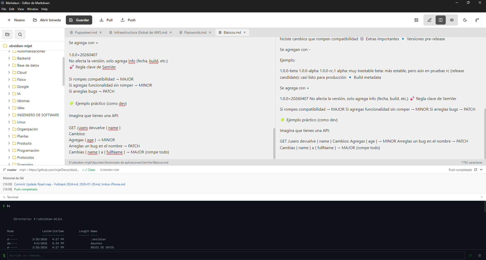
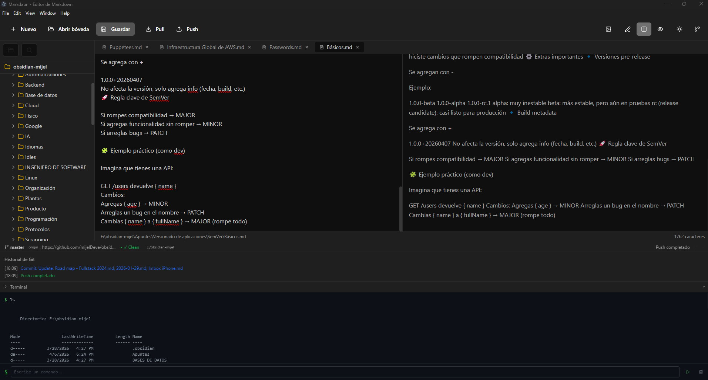

# Markdaun

Editor y visor de Markdown para escritorio con integración Git.


## Características

- **Editor de Markdown**: Edita y visualiza archivos .md con vista dividida (editor + preview)
- **Explorador de archivos**: Navega por tu carpeta de documentos en una barra lateral al estilo Obsidian
  - Botón para cerrar todas las carpetas
  - Botón para encontrar el archivo actual
  - Menú contextual (click derecho) para crear y eliminar archivos/carpetas
- **Gestión de archivos**:
  - Crear nuevas carpetas
  - Crear nuevos archivos .md
  - Eliminar archivos/carpetas con confirmación
- **Integración Git**: Clone, pull, push y commit directamente desde la aplicación
- **Autenticación SSH**: Configura tu clave SSH para Git (ruta o contenido)
- **Terminal integrada**: Ejecuta comandos PowerShell directamente en la barra de estado
- **Soporte GFM**: Tablas, checkboxes, código con resaltado de sintaxis
- **Imágenes**:
  - Imágenes desde URLs externas (``)
  - Wiki-links embebidos (`![[imagen.png]]`)
  - Selector de imágenes integrado (botón en toolbar)
  - Carga de imágenes locales como base64
- **Scroll sincronizado**: Desplazamiento sincronizado entre editor y preview en modo dividida
- **Temas claro/oscuro**: Cambio de tema con persistencia de preferencias
- **Múltiples pestañas**: Trabaja con varios archivos simultáneamente
- **Icono de aplicación**: Icono personalizado para Windows

## Capturas de pantalla

### Modo Claro



### Modo Oscuro



## Instalación

### Windows

#### Opción 1: Ejecutable portable (recomendado)

1. Descarga el archivo `Markdaun-1.0.0-Portable.zip` o el ejecutable `Markdaun.exe` de la sección de releases
2. Extrae el ZIP si es necesario
3. Ejecuta `Markdaun.exe` directamente - no requiere instalación

#### Opción 2: Construir desde código fuente

1. Asegúrate de tener instalado:
   - [Node.js 18+](https://nodejs.org/)
   - [Git](https://git-scm.com/)
2. Clona el repositorio:
   ```bash
   git clone https://github.com/markdaun/markdaun.git
   cd markdaun
   ```
3. Instala las dependencias:
   ```bash
   npm install
   ```
4. Construye la aplicación:
   ```bash
   npm run build
   ```
5. El ejecutable se encontrará en `dist/win-unpacked/Markdaun.exe`

### Linux

#### Requisitos previos

- Node.js 18+
- Git
- npm o yarn

#### Pasos para instalación

1. Clona el repositorio:

   ```bash
   git clone https://github.com/markdaun/markdaun.git
   cd markdaun
   ```

2. Instala las dependencias:

   ```bash
   npm install
   ```

3. Construye la aplicación:

   ```bash
   npm run build
   ```

4. Genera los instaladores para Linux:

   ```bash
   npm run build:linux
   ```

5. En la carpeta `dist/` encontrarás:
   - `Markdaun-1.0.0.AppImage` - AppImage (funciona en todas las distribuciones)
   - `Markdaun-1.0.0.deb` - Paquete Debian/Ubuntu
   - `Markdaun-1.0.0.rpm` - Paquete Fedora/RHEL

#### Cómo instalar según tu distribución

**Arch Linux / Manjaro (usando AppImage):**

```bash
# Haz ejecutable el AppImage
chmod +x Markdaun-1.0.0.AppImage

# Opción A: Ejecutar directamente desde cualquier ubicación
./Markdaun-1.0.0.AppImage

# Opción B: Instalar en el sistema (recomendado)
# Copiar a una carpeta en PATH
sudo cp Markdaun-1.0.0.AppImage /usr/local/bin/markdaun
sudo chmod +x /usr/local/bin/markdaun

# Opción C: Crear entrada en el menú (archivo .desktop)
mkdir -p ~/.local/share/applications
cat > ~/.local/share/applications/markdaun.desktop << 'EOF'
[Desktop Entry]
Name=Markdaun
Comment=Editor de Markdown con Git
Exec=/usr/local/bin/markdaun
Icon=text-markdown
Terminal=false
Type=Application
Categories=Utility;TextEditor;
EOF
```

**Ubuntu/Debian (usando .deb):**

```bash
sudo dpkg -i Markdaun-1.0.0.deb
# Si hay dependencias faltantes:
sudo apt-get install -f
```

**Fedora/RHEL (usando .rpm):**

```bash
sudo dnf install Markdaun-1.0.0.rpm
```

#### Notas adicionales para Linux

- En algunas distribuciones puede ser necesario instalar dependencias adicionales:

  ```bash
  # Debian/Ubuntu
  sudo apt-get install libgtk-3-0 libnss3 libxss1 libasound2

  # Fedora/RHEL
  sudo dnf install gtk3 nss xorg-x11-libs alsa-lib

  # Arch/Manjaro
  sudo pacman -S gtk3 nss alsa-lib
  ```

- Para ejecutar en modo desarrollo:
  ```bash
  npm run dev
  ```

### macOS

1. Clona el repositorio:

   ```bash
   git clone https://github.com/markdaun/markdaun.git
   cd markdaun
   ```

2. Instala las dependencias y construye:

   ```bash
   npm install
   npm run build:mac
   ```

3. El archivo .dmg se encontrará en la carpeta `dist/`

## Uso

### Abrir archivos/carpetas

1. Haz clic en "Abrir archivo" o "Abrir carpeta" desde el menú
2. Navega por el explorador lateral para seleccionar archivos .md

### Integración Git

1. Abre el panel de Git desde el menú o la barra de estado
2. Configura la URL del repositorio remoto
3. Ingresa tu clave SSH (ruta al archivo o contenido directo)
4. Ejecuta operaciones Git:
   - **Clone**: Clona un repositorio remoto
   - **Pull**: Descarga cambios del remoto
   - **Push**: Sube cambios al remoto
   - **Commit**: Guarda cambios locales

### Terminal

1. Haz clic en el ícono de terminal en la barra de estado
2. Escribe comandos PowerShell
3. Usa las flechas ↑↓ para navegar el historial

### Temas

- Haz clic en el ícono de sol/luna para alternar entre modo claro y oscuro
- El tema se guarda automáticamente en localStorage

## Comandos disponibles

| Comando               | Descripción                |
| --------------------- | -------------------------- |
| `npm run dev`         | Iniciar desarrollo         |
| `npm run build`       | Construir aplicación       |
| `npm run build:win`   | Generar instalador Windows |
| `npm run build:mac`   | Generar instalador macOS   |
| `npm run build:linux` | Generar instalador Linux   |
| `npm run lint`        | Verificar código           |
| `npm run typecheck`   | Verificar tipos            |

## Estructura del proyecto

```
markdaun/
├── src/
│   ├── main/           # Proceso principal Electron
│   │   └── index.ts   # Entry point, handlers IPC, logging
│   ├── preload/       # Scripts de preload para IPC
│   │   └── index.ts   # API expuesta al renderer
│   └── renderer/      # Aplicación React
│       ├── src/
│       │   ├── App.tsx          # Componente principal
│       │   ├── index.css        # Variables CSS y temas
│       │   ├── main.tsx         # Entry point React
│       │   └── components/
│       │       ├── Sidebar.tsx      # Explorador de archivos
│       │       ├── Editor.tsx       # Editor markdown
│       │       ├── Preview.tsx      # Vista previa
│       │       ├── GitPanel.tsx     # Panel de configuración Git
│       │       └── GitStatusBar.tsx # Barra de estado con terminal
│       └── index.html
├── electron.vite.config.ts
├── package.json
├── tsconfig.json
├── tailwind.config.js
└── postcss.config.js
```

## Tecnologías utilizadas

- **Electron**: Framework de escritorio
- **React 18**: Biblioteca de UI
- **TypeScript**: Tipado estático
- **Vite**: Build tool
- **TailwindCSS**: Estilos
- **react-markdown**: Renderizado de markdown
- **remark-gfm**: Soporte GitHub Flavored Markdown
- **react-syntax-highlighter**: Resaltado de sintaxis
- **simple-git**: Cliente Git
- **electron-log**: Logging
- **lucide-react**: Iconos

## Contribuciones

Las contribuciones son bienvenidas. Por favor, abre un issue o pull request.

## Licencia

MIT
